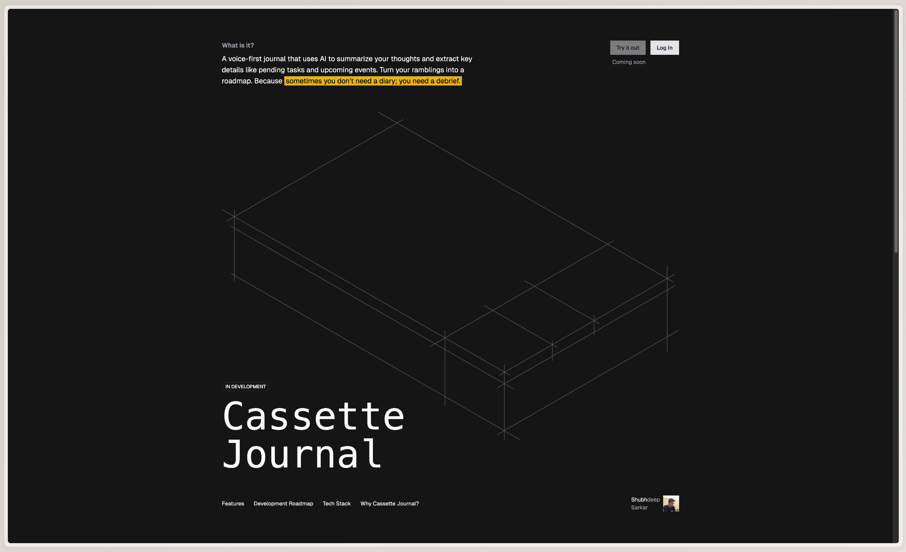

# Cassette Journal

A voice-first journal that uses AI to summarize your thoughts and extract key details like pending tasks and upcoming events. Turn your ramblings into a roadmap.

<!-- image -->

## About

Cassette Journal is an experimental project that combines journaling with voice-to-text transcription and AI-powered analysis. Record your thoughts, and let AI help you organize them into actionable insights, summaries, and scheduled events.

The name is inspired by the analog feel of cassette players—bringing nostalgic, tactile interactions to a modern journaling experience.

## Features

- **Voice Recording** - Record your thoughts directly in the app
- **Speech-to-Text Transcription** - Powered by OpenAI Whisper for accurate transcription
- **AI Summarization** - Automatic summaries of your recordings (3-5 bullet points)
- **Task Extraction** - AI identifies and extracts action items from your voice notes
- **Event Recognition** - Automatically detects upcoming events mentioned in your recordings
- **Editable Transcripts** - Edit transcribed text before saving
- **User Authentication** - Secure login with Auth0 and Google
- **Dark Mode Support** - Full dark/light theme support

## Current Development Status

### Phase 0: Initial Setup ✅ DONE

- Project setup with Next.js, NeonDB, DrizzleORM, and shadcn/ui
- User authentication with Auth0
- Basic UI for entry listing and individual note pages
- Speech-to-text transcription with OpenAI Whisper

### Phase 1: AI Features 🚀 IN PROGRESS

- LLM research and testing for core AI features
- Prompt engineering for debrief summarization
- Task and event extraction logic
- Structured output display on note pages
- Complete UI/UX flow implementation

### Phase 2: UI/UX & Performance (Planned)

- Final UI designs with 3D cassette aesthetic
- Performance optimization and database query optimization
- Consolidated view for all extracted tasks and events
- Basic keyword search across transcripts

## Tech Stack

- **Frontend**: Next.js, React, Tailwind CSS, shadcn/ui
- **Backend**: Next.js API Routes
- **Database**: NeonDB (PostgreSQL), Drizzle ORM
- **Authentication**: Auth0
- **AI/ML**: OpenAI Whisper (transcription)
- **Fonts**: Geist (Google Fonts)
- **Development**: Windsurf, Claude Sonnet/Haiku, Gemini 3
